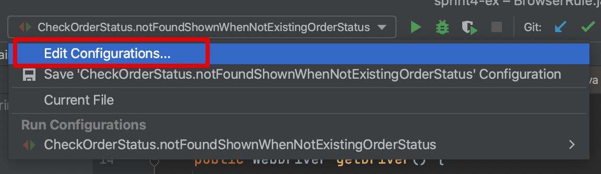
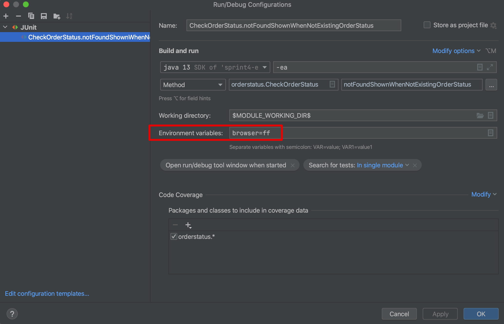

## Проект-пример Спринта 4

Пример UI автотестов для [Сервиса QA Scooter](https://qa-scooter.praktikum-services.ru/).
Использует JUnit 4 и Selenium в качестве основных зависимостей.

### Запуск Автотестов в Разных Браузерах

Автотесты могут запускаться в браузерах Chrome и Firefox.
По умолчанию, если не передавать дополнительных параметров, тесты запустятся в Chrome.

Чтобы выбрать Firefox при запуске автотеста в Idea нужно в верхней панели открыть выпадающее меню это теста и нажать пункт "Edit Configurations":

Затем в открывшемся окне в поле "Environment variables" ввести "browser=ff":

После этого данных автотест будет запускаться в браузере Firefox. Чтобы вернуться к Chrome удалите эту запись их его конфигурации.
